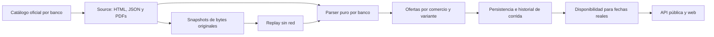

# Arquitectura implementada del scraping

Actualizado el **6 de octubre de 2026**. La zona del producto es `America/Asuncion`.

El catálogo que consulta la web se almacena en PostgreSQL. Abrir o filtrar la
web no inicia scraping. Cada banco tiene adquisición y parsing propios; comparte
HTTP, snapshots, contrato de ofertas, calendario, persistencia y auditoría.

Los parsers reconocen fechas enumeradas, variantes de billetera, matrices Black,
catálogos regionales y eventos. Las advertencias actuales se renuevan al persistir
una observación; los errores históricos permanecen en su corrida de origen.
La versión vigente `canonical-v4` incluye el catálogo de la API pública GNB,
sus variantes y un fallback HTTPX acotado al dominio oficial.



## Responsabilidades

| Archivo/carpeta | Qué hace |
| --- | --- |
| `base.py` | Contratos `BaseSource.fetch()` y `BaseParser.parse(source)`. |
| `registry.py` | Define `BankSlug`, `BANKS` y `ADAPTER_VERSION` sin cargar configuración, DB ni adaptadores. |
| `factories.py` | Importa únicamente el source/parser del banco solicitado; no carga todos los bancos ni Gemini al importarse. |
| `sources/` | Descubre detalles, categorías, páginas y adjuntos; obtiene bytes mediante `HttpClient`. |
| `sources/helpers.py` | URLs relativas y adquisición de PDF del host oficial; error explícito de discovery. |
| `sources/bank_documents.py` | Adquisición validada de PDFs e imágenes de bases/adheridos desde enlaces y atributos de popup. |
| `sources/ueno_catalog.py` | Descubre el PDF mensual de Alianzas y lee sus anotaciones hacia bases legales. |
| `schemas.py` | `ScrapedSource`, sus `documents` adjuntos y `ScrapedPromotion` con `source_key` y ofertas canónicas. |
| `parsers/` | Interpreta HTML, JSON o PDFs ya adquiridos. Los adaptadores normales no realizan requests ni llamadas IA. |
| `parsers/gnb_api_parser.py` | Interpreta un registro de la API pública GNB, separa variantes y contrasta descripción, fechas del catálogo y PDF legal. |
| `parsers/pdf_offers.py` | Lectura de páginas/tablas con pdfplumber y esquemas documentales reconocidos. Funciones puras también aceptan fixtures de celdas. |
| `parsers/ueno_legal_tables.py` | Une tablas de niveles y topes a anexos explícitos de comercios, sucursales y cuotas. |
| `ocr_review.py` | OCR local de snapshots para revisión con página/confianza/coordenadas; no publica ofertas. |
| `utils/schedule.py` | Calendario conservador en español; weekdays ISO 1–7 y reglas mensuales/puntuales. |
| `utils/offers.py` | Fechas contractuales, beneficios, elegibilidad, topes y evidencia. |
| `clients/http_client.py` | HTTP acotado con Requests primario, fallback HTTPX opt-in ante 403, reintentos, hosts permitidos, observador de snapshots y replay/cache por corrida. |
| `clients/__init__.py` | Conserva imports explícitos de clientes mediante carga diferida; importar el paquete no carga Gemini. |
| `snapshots.py` | Conserva bytes originales por hash; permite recuperar la evidencia sin red. |
| `runner.py` | Lock por banco, presupuesto, estado/counters/errores, persistencia y retiros prudentes. |
| `persistence.py` | Identidad, upsert conservador, variantes, overrides y regeneración de ocurrencias. |
| `cli.py` | Corridas manuales, worker periódico, replay y actualización del calendario. |
| `experimental/` | Implementaciones históricas de `ueno-pdf`, categorización, enriquecimiento, servicio sencillo y prompts, separadas del recorrido canónico. |
| `../promotions/` | Contrato validado, evaluación temporal, ocurrencias y respuestas públicas. |

Los paquetes `scraping`, `clients`, `parsers`, `sources` y `prompts` no importan
adaptadores ni experimentos automáticamente. La selección de un banco carga sus
módulos y las utilidades compartidas que necesita; un fallo al importar otro
adaptador no impide construir el seleccionado. Los parsers y el registro pueden
importarse sin credenciales de DB o IA. La construcción de sources Ueno/Itaú/GNB sí
lee la configuración del límite de detalles.

Los paths antiguos `service.py`, `categorization.py`, `enrichment.py`,
`parsers/ueno_parser.py`, `sources/ueno_source.py` y `prompts/*.py` conservan
bridges de compatibilidad hacia `experimental/` para consumidores explícitos.
`service.py` apunta al coordinador histórico sin persistencia; no es el punto de
entrada del worker. La factory `ueno-pdf` verifica `ENABLE_AI_ENRICHMENT` antes
de importar el experimento o Gemini, y utiliza `AI_MODEL`. La categorización y
el enriquecimiento históricos también exigen ese opt-in para ejecutar IA.
Estos componentes no reemplazan el flujo canónico de ofertas.

Para operación con DB, snapshots y auditoría se usa el runner a través de la CLI
o administración autenticada, no los antiguos GET públicos de escritura. API y
worker toman `ADAPTER_VERSION` del mismo registro: la API identifica la corrida
encolada y, al iniciarla, el worker actualiza versión y PID con los valores que
realmente ejecuta. Esto cubre filas encoladas antes de un cambio de versión. Los
documentos de esa corrida reciben la misma versión en `parser_version`; no se
reescribe la versión histórica de documentos de corridas anteriores.

## Contrato entre source y parser

Una `ScrapedSource` incluye la URL y el HTML/JSON/bytes original. Los PDFs se adquieren
en el source y se entregan como `documents: list[ScrapedSource]`. En GNB la
respuesta original del listado JSON queda en snapshots y cada candidato usa
un registro de ese listado; la evidencia cita la URL de la API que se descargó.
La URL pública de detalle se conserva para que el usuario abra el beneficio.
Una descarga
fallida registra `document_error`; no se reemplaza un PDF por un resumen vacío.

El parser devuelve una promoción por comercio de una campaña con sus variantes.
`ScrapedPromotion.offers` contiene `OfferData`, definido en
[`promotions/schemas.py`](../promotions/schemas.py). Sus campos relevantes son:

- Comercio y clave de variante; URL oficial y evidencia con página/sección/método.
- Inicio/fin y `validity_state`: `known`, `unknown` o `conflict`. Falta de una
  fecha no significa vigencia abierta; `start_open`/`end_open` requieren evidencia.
- `schedule`: días semanales, día/rango mensual, ordinal mensual o fechas puntuales.
- Lista de beneficios: descuento, reintegro, cuotas y otros; pueden coexistir.
- Tarjeta, tipo, nivel, canal/procesadora, condiciones y personalización requerida.
- Topes separados de compra/reintegro, con período y alcance.
- `publication`: `confirmed`, `pending` o `retired`.

Un cupón de importe fijo conserva el importe en el `label` del beneficio; no se
convierte a un porcentaje. Los valores escalares antiguos solo se proyectan si
las variantes comparten realmente el mismo porcentaje/tipo.

`metadata.offers_complete` indica si se reconocieron todas las variantes del
candidato actual. Solo una extracción completa puede sustituir sus variantes
anteriores; una extracción incompleta conserva evidencia y retira la confirmación
según la política de persistencia. Esto es distinto de retirar una promoción por
no aparecer en el catálogo de una corrida parcial.

## Particularidades de los cinco bancos

### Ueno

Fuente principal: [Alianzas Ueno](https://www.ueno.com.py/alianzas-ueno/) y su PDF mensual. Sus anotaciones enlazan bases legales sin interpretar logos como comercios. El [índice legal](https://www.ueno.com.py/informacion-legal/) complementa el recorrido y se deduplica por URL; un fallback deja advertencia. El mes de una URL no declara vencida una campaña.

- POWER: reconoce ocho columnas, hereda únicamente las celdas fusionadas del
  grupo y conserva comercio/procesadora propios. Los días enumerados del mes se
  convierten a fechas reales y se validan contra el weekday declarado. Beneficio
  base y variante con adicional personalizado permanecen separados.
- Combustibles: ofrece emblemas expresamente incluidos y cada nivel con su
  porcentaje/tope semanal de compra/reintegro. Los días de renovación del tope
  no se usan como días de compra. La sucursal debe estar en el anexo oficial;
  el catálogo todavía no es una búsqueda geográfica de estaciones.
- Cupones: conserva clientes seleccionados, activación previa, único uso,
  mínimo de compra, importe fijo o porcentaje y cuotas opcionales solo para crédito.
- Combos: separa servicios/Bolt/Burger King y usa la vigencia y topes de cada
  beneficio, que pueden empezar después de la campaña general.

Otros documentos con tablas o porcentajes incompatibles requieren una regla
específica/fixture nueva; permanecen pendientes y generan advertencia. El mes del
título nunca reemplaza las fechas del documento. Los contratos generales con tablas de nivel/tope se unen a sus propios anexos de comercios; reintegro y cuotas no comparten automáticamente adheridos. No hay OCR que publique ofertas automáticamente.

### Sudameris

Fuentes: [destacados](https://www.sudameris.com.py/beneficios/) y
[promociones](https://www.sudameris.com.py/beneficios/promociones). Los IDs tienen
namespace (`destacado:…`, `promocion:…`); coincidir numéricamente no implica ser
la misma promoción. Los PDFs se adquieren aunque el HTML parezca suficiente.

- Gastronomía tabular: cada fila conserva comercio, días, vigencia y tope mensual
  por comercio/cuenta. Un adicional Black/Infinite genera su variante coherente.
- Template textual `VIGENCIA / BENEFICIOS / CONDICIONES`: combina descuento,
  reintegro y cuotas cuando corresponden a la misma compra, o separa porcentajes
  por tarjeta. Cuotas exclusivas para alojamiento son una variante condicionada.
- PLUB mantiene el último viernes mensual; Biggie mantiene el día 1 mensual.

Los PDFs escaneados o diseños no reconocidos quedan pendientes. La extracción
normal funciona sin Gemini y no asigna a todos los comercios el primer porcentaje.

### Itaú

Fuente: [beneficios](https://www.itau.com.py/beneficios), con fallback oficial a `/beneficios2/` que deja advertencia. Descubre categorías,
incluye grupos ocultos `data-page`, deduplica `(b,c)` y solicita el fragmento
`Detalle?b=…&c=…`. Conserva IDs y categorías originales, incluidas las etiquetas de
tarjeta que no necesariamente son rubros.

Los campos de beneficio, vigencia y pago se contrastan con el párrafo comercial,
que puede contener los días/canal. Las tarjetas citadas únicamente como
acumuladoras de puntos no se convierten en requisito para el descuento. Fechas
contradictorias conservan ambas evidencias y quedan pendientes. Dos porcentajes
no separados correctamente dentro de una cláusula requieren revisión; el badge
“hasta” no se usa para anunciar el máximo como universal.

### Atlas

Fuente: [beneficios](https://www.bancoatlas.com.py/web/beneficios). Recorre la
paginación publicada y parsea cards `.benefit-card[data-nombre]`, incluso cuando
el JSON-LD contiene más ofertas que las visibles en la página actual.

Los atributos `data-*` contienen días, condiciones, cuotas, ciudades y topes.
El JSON-LD correspondiente contrasta las fechas. Una discrepancia queda en
`conflict`; no se elige automáticamente la fecha más conveniente. El adicional
por tarjeta y los topes de cada fila se asocian a esa variante. Un tope compartido
conserva la variante base y la tarjeta especial por separado.

Los botones `data-boton-url` adquieren PDFs e imágenes de adheridos o bases legales. Los documentos legales conservan términos completos y evidencia por página; un archivo escaneado o contradictorio queda pendiente. Un anexo gráfico de adheridos deja ubicaciones desconocidas y enlace oficial sin ampliar la campaña a todos los comercios.

El sitio no expone un ID numérico estable en las cards inspeccionadas. La clave
actual usa comercio y blob del logo como señales; si ambos cambian puede requerir
reconciliación manual. No se presupone que cualquier tienda de un shopping sea
adherida: las condiciones/enlaces oficiales siguen siendo necesarios.

### GNB

El [sitio de tarjetas del banco](https://www.bancognb.com.py/public/tarjetas-credito.jsp)
enlaza a [su portal de beneficios](https://www.beneficiosbancognb.com.py/v2/beneficios).
La lectura con Requests y con el navegador estándar recibió **HTTP 403** durante
la verificación inicial. El 6 de octubre se identificó una combinación HTTPX
accesible y la API pública utilizada por la aplicación Angular de producción.

- El cliente Requests se prueba primero. Solo un 403 del host exacto
  `www.beneficiosbancognb.com.py` habilita HTTPX. GNB opta por su User-Agent
  estándar `python-httpx/<versión>`; los demás headers se conservan. El cliente
  sigue siendo síncrono HTTP/1.1 y comparte validación de hosts, redirects,
  timeout, tamaño máximo, cache y snapshots. Un replay usa los bytes guardados
  sin inicializar el segundo cliente ni solicitar red.
- La presencia de `<app-root>` selecciona la API pública
  `/v2/apis/rewards/rewards/v1/benefits/benefits`. Sus páginas devuelven registros
  completos: se valida paginación, total y duplicados antes de entregar candidatos.
  La captura con `pageSize=999&paginationKey=0` devolvió 242 registros y evita
  solicitar un detalle HTTP adicional por cada promoción. Truncar el catálogo
  por configuración conserva la advertencia de cobertura parcial.
- Cada registro conserva `gnb:<id>` como identidad, URL pública de detalle,
  título, descripción HTML y fechas. Las cláusulas separan tarjetas Black,
  Clásica/Oro, prepagas, beneficios base, adicionales QR y cuotas. Un adicional
  se combina únicamente con una variante compatible y sin ambigüedad.
- Los enlaces de las bases llegan dentro de un descriptor PHP serializado.
  Se extrae solo el campo de ruta reconocido, que comienza por `imagenes/`,
  y se valida como URL PDF del dominio oficial; no se evalúa ni deserializa PHP. Los PDFs
  se adquieren en el source, se valida su cabecera y se adjuntan por rol.
- Fechas incompatibles entre campos del catálogo, descripción o PDF quedan
  en `conflict` y pendientes. Topes por tarjeta sin asociación inequívoca,
  PDFs ilegibles y diferencias de beneficio/elegibilidad también requieren
  revisión. El encabezado “hasta” no sustituye las variantes concretas.
- Una sucursal explícita puede producir un local. Los anexos de adheridos
  conservan texto y evidencia sin reinterpretar sus porcentajes como condiciones
  generales. Dos consultas públicas de branches devolvieron listas vacías;
  no hay una extracción geográfica completa de todos los locales del catálogo.

El parser PDF anterior sigue cubriendo crédito/prepagas sin trasladarles el
tope de una cuenta de crédito. La fixture Popeyes venció en junio de 2026 y
sirve exclusivamente como prueba. El HTML estático histórico conserva su
recorrido compatible; el portal Angular se obtiene mediante la API.
El acceso puede variar entre Windows y Docker. La regla concreta del servidor
que genera el 403 es desconocida; una respuesta futura rechazada conserva
un fallo explícito y los datos anteriores.

## Operación, límites y evidencia

Desde `api/` (o dentro del contenedor del API):

```sh
python -m app.scraping.cli run --bank ueno
python -m app.scraping.cli run --bank all
python -m app.scraping.cli replay --document-id 123
python -m app.scraping.cli refresh-calendar
python -m app.scraping.cli ocr-review --document-id 123 --pages 1 2
```

El worker opcional ejecuta la cola y el calendario periódicamente; su arranque y
configuración Docker están en el README del repo. Los adaptadores normales no
requieren clave IA. `ueno-pdf` es un experimento antiguo separado, exige opt-in
`ENABLE_AI_ENRICHMENT`, y no forma parte del catálogo de cinco bancos del worker.
Las propuestas IA no sustituyen silenciosamente una oferta publicada.

`SCRAPING_MAX_DETAILS_PER_BANK` limita los detalles de Ueno/Itaú/GNB; actualmente el
valor de configuración por defecto es 600. Truncar un catálogo produce
`discovery_warning` y una corrida parcial, sin retiro por ausencia. El runner
acota también documentos y tiempo; fallos de HTTP/selector/PDF se auditan como
`failed` o `partial`, no como catálogo vacío exitoso.

`parse_warning` diferencia PDF ilegible, OCR necesario, variantes no reconocidas
u otras ambigüedades. Los datos pendientes pueden revisarse o reextraerse desde
snapshots. Una caída de cobertura no autoriza archivar todas las promociones.

## Verificación y límites conocidos

Las pruebas de cada banco están en [`tests/banks/`](../../tests/banks/), con un
módulo para Ueno, Sudameris, Itaú, Atlas y GNB. Discovery, parsing, variantes y
topes se verifican por banco sin red ni DB. Las reglas compartidas de calendario
están en [`test_schedule_extraction.py`](../../tests/test_schedule_extraction.py)
y la adquisición validada de documentos en
[`test_document_acquisition.py`](../../tests/test_document_acquisition.py).
El [transporte HTTPX](../../tests/test_http_transport.py) se prueba con respuestas
controladas: activación por host/status, headers, redirects, errores, límites,
cache y replay sin red.
Los [fixtures](../../tests/fixtures/parsers/README.md) conservan pequeños
fragmentos reales y celdas de tablas con sus URLs/páginas. Cubren también
negaciones, rangos circulares, eventos sin año, conflictos y adquisición bloqueada.

```sh
# Desde api/
python -m pytest -q tests/banks tests/test_schedule_extraction.py tests/test_document_acquisition.py tests/test_http_transport.py
python -m pytest -q tests/test_adapter_loading.py
```

[`test_adapter_loading.py`](../../tests/test_adapter_loading.py) usa intérpretes
limpios sin credenciales para detectar imports eager: comprueba que registry y
paquetes no necesitan DB/IA, que seleccionar un banco funciona aun si los otros
adaptadores no pueden importarse, y que `ueno-pdf` exige opt-in y conserva el
modelo configurado. Las pruebas de cola, versión del runner y documentos están
en [`test_ingestion.py`](../../tests/test_ingestion.py) y requieren un PostgreSQL
de pruebas identificado mediante `TEST_DATABASE_URL`.

También se comprobaron muestras públicas de HTML y PDFs y se reextrajeron
snapshots reales. Estas comprobaciones puntuales acreditan los formatos cubiertos;
no prueban que todos los documentos presentes/futuros de cada banco estén
interpretados. Añadir otro layout requiere fixture y regla propia. Siguen siendo
límites concretos las discrepancias de fechas y elegibilidad en GNB, la
disponibilidad de su portal, los PDF escaneados, layouts no
reconocidos, identidades Atlas sin ID oficial y comercios/sucursales únicamente
listados en imágenes/anexos sin normalización geográfica completa.
