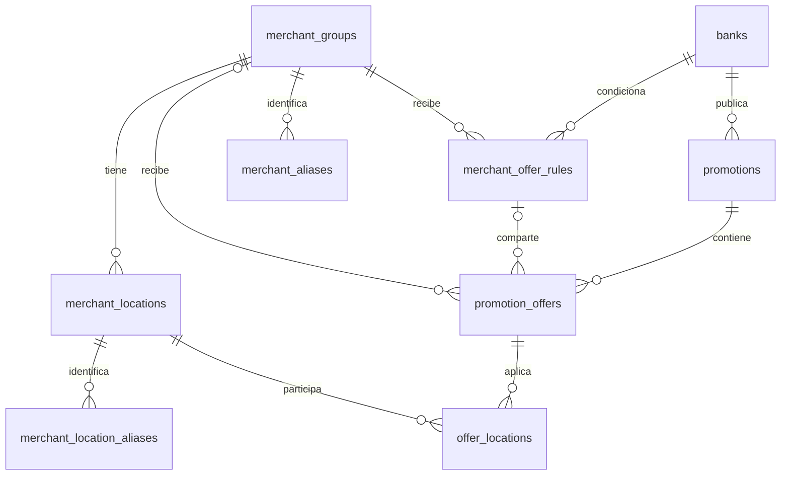

# ADR 006: comercios, sucursales y adhesión a ofertas

Fecha: 5 de octubre de 2026. Estado: **implementado** mediante `20261005_merchant_membership`.

## Contexto previo a la implementación

La aplicación debe permitir una tarjeta de Petropar, Superseis u otro comercio y consultar sus locales por ciudad. La identidad de un comercio debe poder reutilizarse entre bancos, conservando las condiciones particulares de cada oferta.

La base de desarrollo está en `20261003_offers_and_ingestion (head)`. `alembic check` no detectó operaciones pendientes entre los modelos y el esquema. Las migraciones existentes conservan las tablas históricas y agregan ofertas, calendario y trazabilidad.

Ya existen `merchant_groups` y `merchant_locations`, pero en la base revisada ambas están vacías. `promotion_offers` todavía conserva comercio, ciudad y dirección dentro de su contrato JSONB. No tiene una relación con esos catálogos. El parser puede repetir una regla por estación y nivel; la API condensa reglas idénticas para presentar Petropar como una tarjeta.

La agrupación actual de Petropar reconoce específicamente el contrato de Ueno. No constituye todavía una agrupación general para Superseis u otros bancos. Su identidad de presentación depende del PDF y la vigencia.

## Decisión aplicada

Reutilizar las tablas comerciales existentes y mantener un modelo mixto: relaciones SQL para identidades y adhesiones, JSONB validado para las reglas bancarias variables.

| Entidad | Responsabilidad |
| --- | --- |
| `merchant_groups` | Comercio o marca estable, como Superseis o Petropar, compartida entre bancos. |
| `merchant_locations` | Sucursal física del comercio, con nombre, ciudad y dirección. |
| `promotions` / `campaigns` | Contexto bancario y campaña de origen. Una fuente puede contener varios comercios. |
| `promotion_offers` | Observación de origen conservada, con FK opcional al comercio y a una regla compartida. Mantiene IDs, claves, JSON y correcciones anteriores. |
| `merchant_offer_rules` — nueva | Regla coherente e inmutable compartida por observaciones iguales del mismo comercio, banco y contexto de campaña. |
| `offer_locations` — nueva | Relación entre una oferta y cada sucursal donde está adherida, con estado y evidencia de esa asociación. |
| `merchant_aliases` / `merchant_location_aliases` — nuevas | Referencias estables de origen y asociaciones revisadas a comercios y locales. |

La FK comercial debe situarse en la oferta o en una participación explícita de campaña/comercio. Un único comercio obligatorio en `promotions` impediría representar documentos con varios comercios.

Una regla idéntica para veinte sucursales se guarda una vez y se relaciona con veinte locales. Cuando cambian tarjeta, porcentaje, nivel, tope, canal, procesadora, vigencia o calendario, se conserva otra variante. La deduplicación debe considerar también las correcciones manuales existentes.

La sucursal física pertenece al comercio. Su participación en una promoción pertenece a la oferta bancaria: estar adherida con Ueno no demuestra adhesión con Itaú. Si POS y app tienen condiciones distintas, se enlazan como variantes diferentes. Las vigencias particulares de un local requieren una variante o una restricción explícita de adhesión evaluada en las consultas.

## Identidad y presentación

Usar IDs internos estables y referencias de origen verificadas. Los nombres alternativos publicados por distintos bancos deben relacionarse mediante aliases respaldados por evidencia. Un cambio de dirección, nombre o versión del PDF no debe crear automáticamente otro comercio o campaña.

No asignar una cadena por similitud de texto solamente. Cuando falta evidencia suficiente, mantener el registro sin reconciliar. Distinguir explícitamente locales especificados, todos los locales confirmado por la fuente y alcance desconocido; una relación vacía no equivale a todos los locales.

La UI puede mostrar `Superseis · Ueno` y, dentro, ciudades, sucursales y variantes. También puede ofrecer una entrada Superseis con secciones por banco sobre estas mismas relaciones. La agrupación visual no combina condiciones de bancos o campañas diferentes.

## Migración gradual

1. Crear una revisión nueva después de la actual: FK comercial inicialmente nullable, tabla puente, identidades/aliases de origen y restricciones de unicidad para evitar adhesiones duplicadas.
2. Reconciliar primero fuentes con comercio y locales explícitos. Conservar IDs, slugs, evidencia y asociaciones de correcciones de los registros anteriores. Guardar el mapeo entre observaciones de origen y entidades reconciliadas.
3. Introducir escritura y lectura compatibles con registros reconciliados y antiguos. Mantener la API y las URLs existentes durante la transición.
4. Validar reglas, conteos, localidades, filtros, calendario, paginación y correcciones antes de retirar la lectura anterior. Los casos ambiguos permanecen pendientes.

No editar revisiones ya aplicadas. El backfill de identidades y relaciones es un paso explícito e idempotente; no debe inferir descuentos ni reemplazar datos confirmados por una extracción vacía.

## Implementación y transición

La escritura de ingesta, retiro de variantes y correcciones mantiene las relaciones en la misma transacción. La API consulta estas identidades para agrupar antes de paginar y mantiene una lectura compatible para filas todavía no reconciliadas. Las campañas con varios comercios conservan el detalle original.

Se agregó `merchant_offer_rules` para guardar una sola regla compartida sin destruir las observaciones históricas de `promotion_offers`. Las observaciones mantienen su JSON y la evidencia íntegra; varias pueden apuntar a una misma regla. Las correcciones de un local crean o reutilizan una regla distinta para su observación, sin modificar las demás.

Los aliases automáticos quedan separados por banco. Una referencia explícita del adaptador o una asociación manual revisada permite reutilizar el comercio entre bancos. Las referencias estables de observaciones conservan la identidad ante renombres; los casos sin esa continuidad necesitan revisión. El contexto se apoya en campaña/fuente, rubro y período; una URL nueva del PDF no cambia por sí sola el comercio.

`normalize-merchants` hace un backfill sin red, con simulación por defecto y confirmación mediante `--apply`. `merchant-list` permite revisar el catálogo; `merchant-alias` guarda evidencia y motivo y reconcilia los datos asociados. Ver [operación y recomendaciones](../database/merchant-management.md).

## Criterios de verificación

- Una campaña multicomercio sigue representando cada comercio correctamente.
- Una regla compartida por varios locales genera una sola variante y varias adhesiones.
- Una sucursal puede participar en distintos bancos con condiciones independientes.
- La falta de ciudad no inventa una ubicación; la falta de locales no significa alcance universal.
- Nombre, PDF o URL nuevos conservan la identidad cuando existe evidencia de continuidad.
- Las correcciones por variante/local y las URLs anteriores continúan funcionando.

Referencias: [esquema actual](../database/schema-overview.md), [modelos comerciales](../../app/database/models/merchant_group.py), [ofertas](../../app/database/models/offer.py) y [agrupación actual](../../app/promotions/locations.py).
