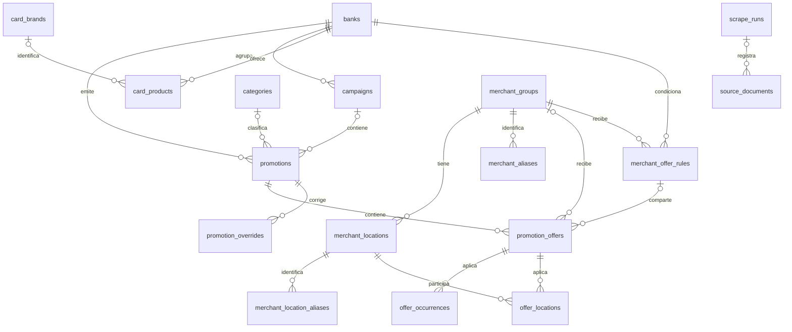

# Esquema implementado

Actualizado el **5 de octubre de 2026**. PostgreSQL es la fuente de consulta de la web; visitar el listado no descarga páginas bancarias. El esquema tiene **17 tablas de negocio**, además de `alembic_version`.

## Campañas, ofertas y condiciones

`promotions` conserva la promoción o campaña de origen y sus URLs públicas anteriores. `promotion_offers` contiene las ofertas concretas: cada registro vincula un comercio, una variante de beneficio, su elegibilidad y una regla temporal. Una campaña gastronómica puede tener varias ofertas para distintos comercios y tarjetas.

La identidad de una promoción es `(bank_id, source_key)`, con restricción única. La identidad de una oferta es `(promotion_id, key)`, también única. Cambiar un título no cambia la identidad ni el slug existente. Los registros históricos pueden conservar `source_key = NULL` hasta que una fuente permita identificarlos sin ambigüedad.

Los campos antiguos `discount_percentage`, `benefit_type`, `start_date`, `end_date`, `status` y `metadata_jsonb` continúan disponibles para compatibilidad. **No son la autoridad para decidir si una oferta aplica a una fecha.** Un máximo de campaña no reemplaza el porcentaje y las condiciones de cada variante.

| Tabla | Contenido y relaciones implementadas |
| --- | --- |
| `banks` | Catálogo de bancos; seed idempotente de Ueno, Sudameris, Itaú, Atlas y GNB. |
| `categories` | Rubros; jerarquía opcional mediante `parent_id`. |
| `promotions` | Fuente/campaña; FK a banco, categoría y campaña opcional. Identidad de origen, publicación y fechas de última observación/verificación. |
| `promotion_offers` | Observación de origen; FK a promoción, comercio y regla compartida opcionales; contrato en `data_jsonb`, alcance de locales, publicación, versión y cobertura temporal. |
| `offer_occurrences` | FK a oferta; PK `(offer_id, applies_on)` y `rules_version`. Índice de consulta por fecha y oferta. |
| `scrape_runs` | Corridas durables: banco, estado, timestamps, versión del adaptador, contadores y errores. |
| `source_documents` | FK opcional a corrida; URL solicitada, hash SHA-256, MIME, respuesta HTTP y ubicación del snapshot original. |
| `promotion_overrides` | Correcciones manuales por promoción/variante, patch, motivo y estado activo. Se superponen al dato fuente sin reemplazarlo. |
| `campaigns` | Campañas comerciales opcionales; FK a banco. |
| `card_brands` | Catálogo de marcas de tarjeta. |
| `card_products` | Productos de tarjeta; FK a banco y marca opcional. |
| `merchant_groups` | Grupos comerciales. |
| `merchant_locations` | Sucursales; FK a grupo comercial, clave de identidad única dentro del comercio y ubicación geográfica opcional. |
| `merchant_aliases` | Namespace/clave de origen únicos; FK a comercio y evidencia de la asociación. |
| `merchant_location_aliases` | Namespace/clave de origen únicos; FK a local y evidencia. |
| `merchant_offer_rules` | Regla compartida e inmutable; FK a comercio/banco, contexto de campaña, huella y condiciones JSON. |
| `offer_locations` | PK `(offer_id, location_id)`, FK a observación y local; estado y datos/evidencia particulares de la adhesión. |

Los comercios y sus locales tienen relaciones normalizadas con las observaciones. Las condiciones bancarias siguen en JSON validado; los productos de tarjeta todavía no están reconciliados con el catálogo `card_products`. `location_scope` distingue locales especificados, alcance universal declarado y alcance desconocido. Una lista vacía no equivale a todos los locales.

Varias observaciones originales pueden apuntar a la misma `merchant_offer_rules`; conservar sus JSON evita perder evidencia o asociaciones de correcciones. La huella de la regla incluye condiciones bancarias y temporales, excluyendo identidad comercial y evidencia de descarga. Las restricciones de ciudad/dirección solo se separan cuando hay locales estructurados. Los aliases automáticos están separados por banco; una asociación revisada puede compartir comercio y local sin compartir las condiciones de sus bancos.



## Contrato canónico

El contrato validado está en [schemas.py](../../app/promotions/schemas.py). `OfferData` incluye:

- Identidad de variante y nombre del comercio.
- Referencia comercial explícita opcional (`merchant`), locales estructurados (`locations`) y `location_scope`.
- `valid_from`, `valid_until`, `validity_state` y límites abiertos explícitos `start_open` / `end_open`.
- `schedule`: estado, recurrencia, días ISO 1–7, días de mes, ordinal, fechas puntuales y exclusiones.
- `benefits`: descuento, reintegro, cuotas, puntos u otro beneficio; porcentaje decimal y condiciones del mismo beneficio.
- `eligibility`: tarjetas, tipo, nivel, canal, procesadora, ciudades, sucursales y condiciones personalizadas.
- `caps`: monto, moneda, tipo de tope, período y alcance. Tope ausente significa desconocido.
- `evidence`: URL/documento, texto, campo, sección, página y método de extracción.
- `publication`: `confirmed`, `pending` o `retired`.

Una vigencia conocida con un límite nulo requiere declarar expresamente que ese límite es abierto. Días no extraídos permanecen `unknown`; contradicciones quedan `conflict`. La consulta no convierte ninguno de esos estados en una coincidencia confirmada.

Una oferta puede contener reintegro y cuotas al mismo tiempo. El tipo de beneficio y un porcentaje mínimo deben coincidir en **el mismo beneficio de la misma variante**, junto con la tarjeta, nivel y fecha consultados.

## Calendario y API

El evaluador único está en [availability.py](../../app/promotions/availability.py). Admite todos los días, recurrencias semanales, días mensuales, ordinales mensuales —incluido el último— y fechas específicas. Aplica primero vigencia y exclusiones; solamente ofertas confirmadas con reglas conocidas generan fechas.

`regenerate_occurrences` calcula 90 días desde la fecha local de Paraguay y reemplaza ocurrencias, versión y cobertura en la transacción del llamador. No hace `commit`. Una nueva versión invalida la cobertura anterior.

La API usa un prefiltro SQL por ocurrencias cuando la versión y cobertura son completas. Las ofertas fuera de cobertura, con índice desactualizado o con correcciones manuales pasan al evaluador. Nunca se devuelve un falso listado vacío por consultar una fecha fuera del horizonte. Con `include_pending=true` también se muestran ofertas desconocidas, con `matched_dates` vacío.

`GET /api/v1/promotions` acepta fecha o intervalo de hasta **31 días**, varios `bank_slug`, rubro, texto, beneficio, porcentaje y condiciones de tarjeta/nivel/canal. Sin fecha usa hoy en `America/Asuncion`. El parámetro `day` sigue disponible: sin intervalo selecciona la próxima fecha de ese día; con intervalo restringe las fechas del período.

Los filtros se aplican sobre variantes completas antes de agrupar por promoción/comercio y antes de contar o paginar. La respuesta incluye `matched_dates`, variantes, disponibilidad y última verificación. `GET /promotions/{slug}` conserva el detalle de la campaña completa.

`GET /api/v1/catalogs/banks` añade salud de la fuente sin revelar errores internos: `data_status` (`updated`, `partial`, `unavailable`, `never`), `last_attempt_at` de la última corrida completada y `last_updated_at` de la última corrida exitosa o parcial. Las corridas en cola o ejecución no reemplazan ese historial. Si la última actualización falla, se conserva la fecha de los últimos datos obtenidos.

## Corridas y documentos

Las corridas usan `queued`, `running`, `success`, `partial` y `failed`. Un catálogo inaccesible o vacío termina como fallo y conserva datos previos. Los errores de detalle pueden producir una corrida parcial. Los faltantes no se retiran automáticamente.

Un lock PostgreSQL por banco impide ejecuciones simultáneas. El endpoint administrativo escribe la cola en PostgreSQL; un worker separado la procesa. Los GET históricos de scraping responden `410`. Las rutas `/admin` requieren token Bearer privado.

El cliente HTTP observa descargas para registrar documentos y snapshots con hash. Los bytes se escriben de forma atómica y el registro del documento usa una transacción independiente: un rollback del parser/persistencia no borra la evidencia descargada. El replay verifica el hash y rechaza cualquier documento ausente, sin salir a la red.

Las correcciones activas se aplican tanto al consultar como al regenerar ocurrencias. El dato original permanece en `data_jsonb`. Una nueva extracción no elimina las correcciones. Los campos opcionales ausentes o vacíos tampoco borran observaciones previas válidas.

El listado administrativo de correcciones señala `source_changed` cuando cambian las condiciones originales. La huella ignora los identificadores de documentos asignados en cada descarga: volver a observar el mismo texto no genera una alerta falsa. Desactivar una corrección conserva su historial y regenera el calendario desde las condiciones originales y las demás correcciones activas.

La asistencia de IA se solicita explícitamente mediante CLI y permanece deshabilitada por defecto. Produce propuestas pendientes, verifica citas contra el snapshot y conserva la identidad de la oferta; no modifica las ofertas publicadas. La cache incluye documento, condiciones, modelo, schema y versión de prompt, y actualiza los identificadores de evidencia al reutilizar el mismo contenido en otra descarga.

## Migraciones y protección de datos históricos

El historial implementado es:

```text
20260511_legacy_baseline
    → b8a7ff77da5a
    → 20261003_offers_and_ingestion
    → 20261005_merchant_membership
```

La baseline contiene una definición congelada de las ocho tablas antiguas; no importa modelos actuales. En una base vacía crea esas tablas. En una base antigua sin historial conserva las tablas existentes y agrega lo que falta. La migración original de porcentaje comprueba si la columna ya existe. Una base marcada con `b8a7ff77da5a` solamente necesita la nueva migración aditiva.

Las promociones históricas quedan pendientes; no hay un backfill que invente disponibilidad o variantes a partir de CSV incompletos. La lectura de registros antiguos es conservadora y mantiene la información conflictiva como evidencia.

La nueva revisión agrega FKs nullable, alcance `unknown`, tablas de aliases, reglas y adhesiones sin modificar observaciones. El backfill comercial es explícito e idempotente: `normalize-merchants` simula y `normalize-merchants --apply` confirma. No descarga fuentes ni reconstruye descuentos ausentes. La ingesta y las correcciones posteriores mantienen las relaciones automáticamente. Ver [operación de comercios](merchant-management.md) y [ADR 006](../adr/006-merchants-and-location-membership.md).

**El downgrade por debajo de `b8a7ff77da5a` está bloqueado:** no es posible distinguir automáticamente tablas/columnas adoptadas de las creadas por Alembic. Para regresar a ese estado se necesita restaurar un backup verificado. Un downgrade de `head` a `b8a7ff77da5a` elimina los objetos nuevos y sus datos; no es un mecanismo de despliegue rutinario.

Las pruebas PostgreSQL cubren instalación vacía, adopción sin historial, actualización desde la revisión original y bloqueo del downgrade destructivo. Usan exclusivamente una base cuyo nombre contiene `test`, con esquemas aislados y transacciones reversibles.

## Referencias

- [Modelos ORM](../../app/database/models/)
- [Contrato HTTP y consulta](../../app/api/v1/routes/promotions.py)
- [Persistencia](../../app/scraping/persistence.py)
- [Runner](../../app/scraping/runner.py)
- [ADR: calendario y ejecución de scraping](../adr/005-offers-calendar-and-ingestion.md)
